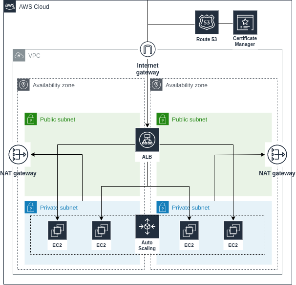

# Basic example #

This provides a template for running a simple architecture on Amazon Web Services. The premise is that you have a stateless application servers running behind ALB serving traffic



## Requirements ##

- **Route 53 Domain**
- **Route 53 Hosted Zone**

## Quick Start ##

### Step 1: Setup variables ###

- Create Terraform workspace `terraform workspace new <environment>`
- Create environmental variable file in `../vars` similar to [../vars/default_aws.yml](../vars/default_aws.yml)
- Change workspace: `terraform workspace select <environnement>`

### Step 2: Start Deployment ###

```bash
terraform init
terraform plan
terraform apply -auto-approve
```
